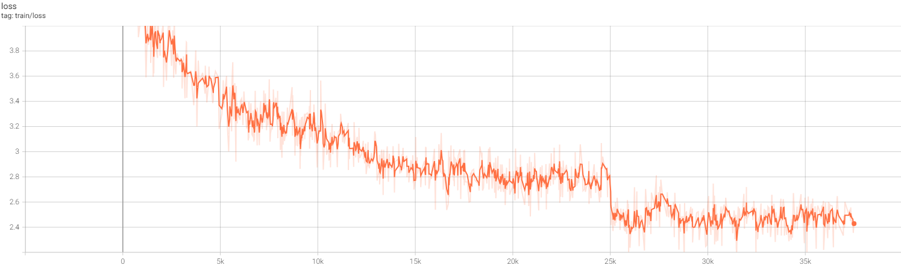

# BitLinear4HF

#### Change any LLM on huggingface to a bitlinear model, and train it within 200 lines of code

This repository provides a script for converting any large language model (LLM) from Hugging Face into a BitLinear model
using our custom `replace_linear_hf` function.

#### Difference from the paper

1. Bitlinear is not applied to lm_head
2. do not apply anything to the input, only apply 1-bit quantization to layer weight

#### Quick Note

The provided training script will work on a single 3090/4090.

It takes 16 hours to train the pretrained `bitlinear-phi-1.5` on single 3090.

## Requirements

- PyTorch
- Transformers
- Datasets (Only for training)
- Bitsandbytes (Only if you want to use 8 bit during training)

## Training Example

Run `train.py`. It uses huggingface `transformers` `Trainer`, 8bit adamW optimizer, fp16 training.

### Converting an LLM to BitLinear

Below is a simple example of how to convert the 'microsoft/phi-1_5' model to use our BitLinear layers:

```python
from transformers import AutoModelForCausalLM, AutoTokenizer
from replace_hf import replace_linear_in_hf

# Initialize tokenizer and model
tokenizer = AutoTokenizer.from_pretrained("microsoft/phi-1_5", trust_remote_code=True)
model = AutoModelForCausalLM.from_pretrained("microsoft/phi-1_5", trust_remote_code=True)

# Replace all linear layers with BitLinear, except for lm_head
replace_linear_in_hf(model, keep_param=False)

print(model)
```

Notice: the custom kernel does not support training yet

## Pretrained Model and Inference

https://huggingface.co/Mrw33554432/bitLinear-phi-1.5

you will still manually run `replace_linear_in_hf(model, keep_param=True)` to make it a BitLinear model

(As we are reusing the model config, and keep maximal code compatibility)

```python
torch.set_default_device("cuda")

tokenizer = AutoTokenizer.from_pretrained("microsoft/phi-1_5", trust_remote_code=True)
model = AutoModelForCausalLM.from_pretrained("Mrw33554432/bitLinear-phi-1.5", trust_remote_code=True)

print(model)

# Choose one from the two options. You have to install custom kernel to get the custom_kernel=True works

# Replace Linear layers with BitLinear
replace_linear_in_hf(model,
                     keep_param=True)  # 2.04s, output: Tom is the name of some places in the U.S. state of Wisconsin:

# significantly faster, for inference
replace_linear_in_hf(model, keep_param=True, custom_kernel=True)  # 0.78s, same output

print(model)
```

## Inference Kernel

The cuda kernel is for inference only at current stage. Along with inference optimization, now the model is 3x faster in
inference.
Check `bitlinear.py` and `kernel` folder for details.

```
cd kernel
python setup.py install
```

Notice 0: VS C++ build tool required

Notice 1: The kernel is faster than pytorch `F.linear` during test, but its influence on inference speed is minor. If
you want to stick with `F.linear`, you can modify the `bitlinear.py` and
replace `obl.mat_mul(x / self.scale, self.weight, self.bias)` with `F.linear(x / self.scale, self.weight, self.bias)`

Notice 2: The `obl.mat_mul(x,w,b)` expect `w` being the weight matrix and only contain -1,0,1. The kernel use a multiply free Implementation.

### Training loss



## License

This project is licensed under the MIT License.

## Contributing

Contributions are welcome! Please submit a pull request or open an issue to suggest changes or additions.

### ToDo

We will need to implement a custom kernel to maximize the potential of BitLinear.

## Acknowledgments

- This work is inspired by the approach suggested in the paper "The Era of 1-bit LLMs: All Large Language Models are in
  1.58 Bits".
- Thanks to the Hugging Face team for providing a robust platform for model sharing and research collaboration.
